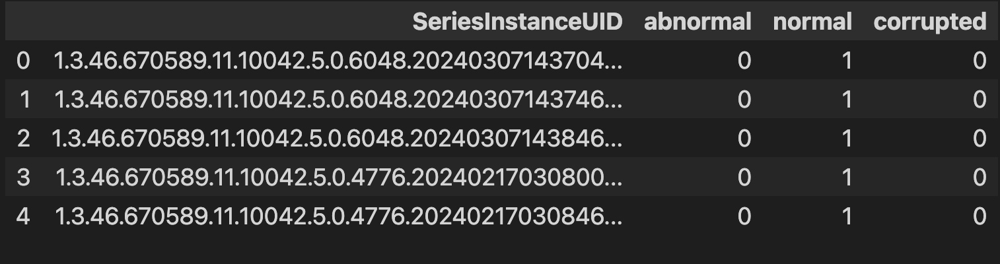

# iAAA-MRI-Challenge

> Unzip data file [`MRI_Labeling_normal_abnormal_SPI_p0_s0.zip`](./MRI_Labeling_normal_abnormal_SPI_p0_s0.zip), the data structure is as shown below:

```
MRI_Labeling_normal_abnormal_SPI_p0_s0
├── data
├── labels.csv
└── labels_dictionary.json
```


### Data Structure

1. `labels_dictionary.json`

> This file is a metadata for labels, it contains **label_name**, **label_type**, and **pixel_value** that exists in the mask file.


```json
{
    "normal": {
        "value": 1, 
        "type": "exam-level/tag"
    }, 
    "abnormal": {
        "value": 2, 
        "type": "exam-level/tag"
    }, 
    "corrupted": {
        "value": 3, 
        "type": "exam-level/tag"
    }
}
```

2. `data` directory

> This folder contains raw DICOM series. DICOM Series ProtocolName is one of `[T1W_SE, T2W_TSE, T2W_FLAIR]`. Each series has [16-18] slices. 

```
data/
├── 1.3.46.670589.11.10042.5.0.1412.2024020416510028127
│   ├── 1.3.46.670589.11.10042.5.0.1412.2024020416515575135.dcm
│   ├── 1.3.46.670589.11.10042.5.0.1412.2024020416515576136.dcm
│   ├── 1.3.46.670589.11.10042.5.0.1412.2024020416515579137.dcm
```

- Path

```
data/SeriesInstanceUID/randomUID.dcm
```

3. `labels.csv`

> This metadata file contains SeriesInstanceUID and labels.


